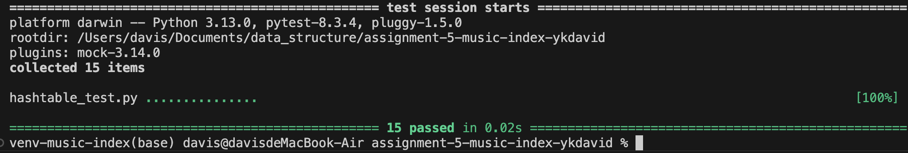
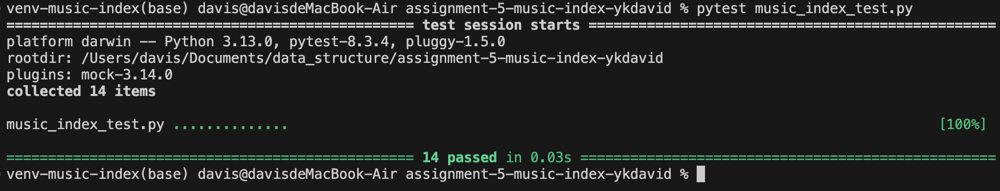
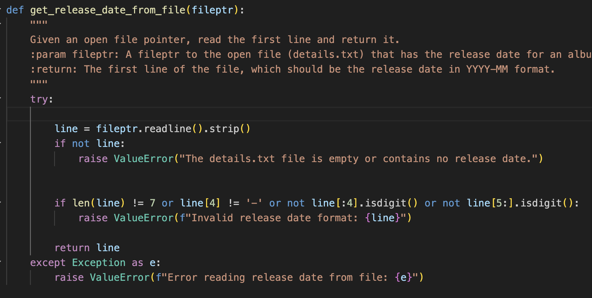
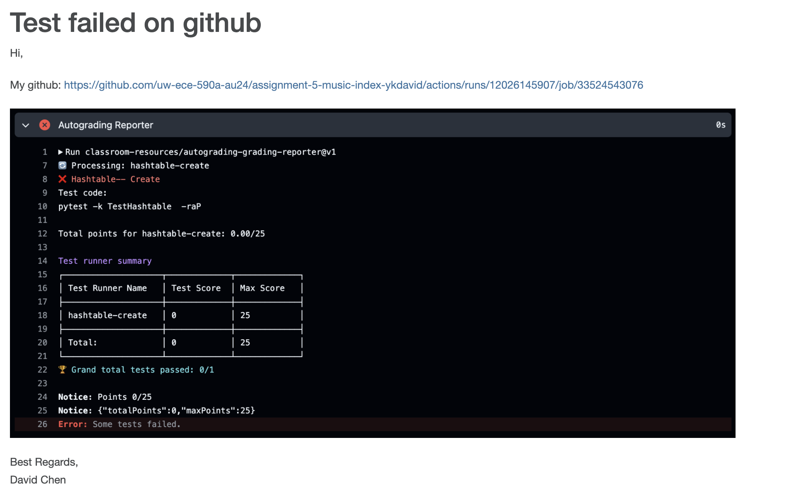

# Data Indexing Assignment

**UW, EE P 590 Fall 2024**

## Author
**Name:** Chen, Wen-Kuang

---

## Assignment Objective
The goal of this assignment is to develop a `Data Indexing` program to efficiently organize, retrieve, and manage music album data stored in a hierarchical file structure. The program leverages a hashtable to index albums by their release date for fast and efficient operations. It also supports features such as:

- Creating playlists based on specified date ranges.
- Retrieving and managing album metadata, tracks, and their respective file paths.
- Handling complex file parsing scenarios and ensuring data integrity.

---

## Overview of My Solution

### Key Features
- **Hashtable Implementation:** A custom hashtable was designed to store multiple albums under the same release date. It supports:
  - Efficient storage and retrieval via the `put` and `get` methods.
  - Checking for existing keys using `key_exists`.
  - Handling dynamic resizing to maintain performance as data grows.
  
- **File Parsing:** Extracted release dates and identified album tracks using robust file system operations. Tracks were organized based on album metadata.

- **Playlist Creation:** Users can generate playlists for albums released within specified date ranges. Albums are copied into a new directory with properly formatted filenames.

- **Error Handling:** Included comprehensive error handling mechanisms to manage missing or malformed `details.txt` files, invalid file paths, and other edge cases.

- **File Handle:** Refined and debugged code to handle missing files, invalid directories, and unexpected scenarios.
  
- **Integration:** Integrated the hashtable with the `MusicIndex` logic, making it possible to connect file system operations with playlist management and metadata indexing.

---

### Key Components

#### **[MusicIndex Class]**
**Purpose:** Acts as the primary data structure to store and retrieve album metadata. It extends the hashtable, where:

- The **key** represents the album release date (in `YYYY-MM` format).
- The **value** is a list of `Album` objects associated with the release date.

**Implementation Highlights:**
- Methods such as `add_album`, `get_albums`, and `write_playlist` efficiently manage album operations.
- Stores data hierarchically based on release dates for fast lookups and efficient indexing.

#### **[Album Class]**
**Purpose:** Represents an album's metadata, including:
- Artist Name
- Release Date
- Album Name
- A list of Tracks (as `Track` objects)

**Implementation Highlights:**
- Formats track names and copies them into a user-specified directory with consistent naming conventions.
- Ensures tracks are renamed and stored correctly in the output directory.

#### **[Track Class]**
**Purpose:** Represents individual tracks, including:
- The track name
- File path for each audio file

**Implementation Highlights:**
- Provides functionality to copy tracks into new directories with updated names based on album metadata.

---

## The Hardest Part

1. **Hashtable Key Management:**
   Managing duplicate keys in the hashtable while appending new albums required careful redesigning of the `put`, `get`, and `add_album` methods. Balancing efficiency and correctness was a critical challenge. It required in-depth debugging and iterative refinement of the data structure’s logic to avoid overwriting data or creating inefficiencies.

2. **File Parsing and Integration:**
   Understanding how to parse `details.txt` files while integrating parsed data into the `MusicIndex` logic was challenging. It involved significant experimentation with directory traversal and handling malformed files. 

3. **Merge Issue:**
   After autograding, I merged feedback to the main branch, which caused other issues and required me to debug iteratively. I also encountered conflicting logic between the two testing files, which demanded extra time to reevaluate and refine the program's logic. Debugging these issues required iterative adjustments to `put`, `get`, and `add_album` to meet test requirements while maintaining logical consistency. Each bug taught me new aspects of how minor changes could impact logic flows.

4. **Using Hashtable Functions:**
   While implementing `MusicIndex`, correctly utilizing the hashtable functions (`put`, `get`, `key_exists`) required iterative testing and debugging. This was particularly tricky when integrating playlist generation logic with file parsing operations. It demonstrated the importance of clearly understanding the interaction between different modules in a program.

5. **Playlist Logic Complexity:**
   Generating playlists by date ranges and ensuring albums and tracks were organized in the correct format involved additional edge case testing, such as missing release dates or invalid file structures. This exercise improved my ability to design algorithms that work reliably under various scenarios.

---

## Something I Learned or Found Interesting

1. **Hashtable Implementation:**
   Designing a hashtable with extended functionality was a fascinating exercise in balancing performance and extensibility. It highlighted the importance of modular design for scalability. I gained a deeper appreciation for the versatility of hashtables in solving complex data storage and retrieval problems.

2. **Mock Testing for Files:**
   Simulating file system operations in unit tests without actual files was a new concept for me. Mocking directory traversal and file reading operations made tests faster and more reliable while allowing comprehensive testing of edge cases. This method was entirely new to me and will be valuable for future projects involving extensive file operations.

3. **Python’s `os` Module:**
   Learning to use Python’s `os` module for file system traversal and error handling provided valuable skills for future projects involving file management. This knowledge gave me the confidence to handle complex file operations programmatically.

---

## Screenshots of Program Execution

### Example 1: Testing `hashtable_test.py`

### Example 2: Testing `music_index_test.py`

### Example 3: Handling Missing Files

### Example 4: Autograding Before Merge Feedback to Main branch

