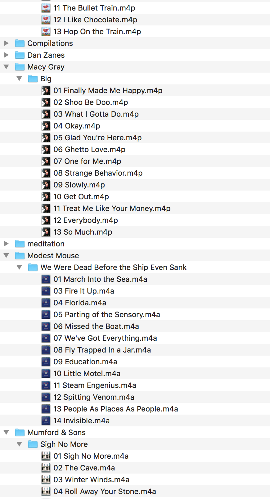
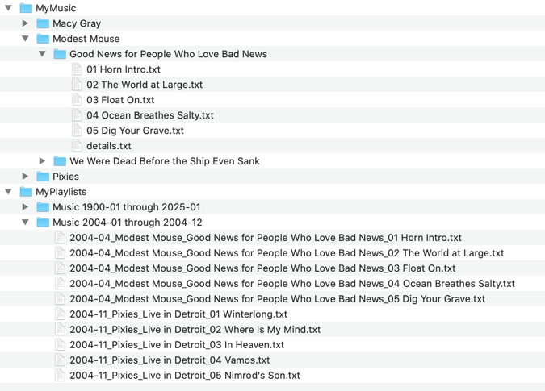

# Assignment 5: Data Indexing

UW, EE 590a Fall 2024

## Objectives

* Implement a hashtable 
* Use a hashtable to index data
* Write a program to load data into the index/hashtable and then to retrieve 
* File manipulation:
  * Traversing directories and files
  * Reading files
  * Copying files
  * Writing files 

### Optional Additions

* Querying Spotify
* Creating a playlist on Spotify 

# Problem

## Background 

My retired neighbor came to me with this problem: 
Over the past few decades, he's digitized all his music from albums, eight-tracks, 
and cassettes to digital files on his Windows95 computer (okay, maybe not Windows 95, but 
it's an old Windows machine that more or less does what he needs it to. kinda.). 
He wants to play all 
his music in his Chevy Suburban SUV, which is about 15 years old and can play music from 
a USB thumb drive or CDs.  The default software allows him to plug in a USB drive with 
his music and choose an Artist, Album or Track to play. However, he'd really like to 
play all of his music in order of when it was released. There's not a great way to 
easily get that information and create a manual playlist with so many music files. 

It occurred to me that given his existing music library, we could extract information about 
each Artist/Album/Track, look up the release date from a service such as Spotify, 
then write out all the files to a new directory (or maybe multiple directories) 
with new filenames that reflect the ordering he wants to play his music in. Then, 
when that's written out to a USB drive, he can plug it into his car and listen to it 
as he wants. Also, it seemed like a fun little problem for us to take on :) 

## Approach 

There are many, many ways someone could go about this problem, but I will sketch out 
a solution that simplifies the problem in some ways while allowing us to exercise our 
learnings about data structures. 

There are three steps: 
* Read all of the files, recursively, in a directory to capture all Artists, Albums and Tracks there are
  * If needed, lookup the release date (month, year) of the Album
* Put each album into a hashtable to help us index them
* Use the hashtable to read out various subsections of the albums, writing each track out in a new folder in a specified order

### Example Input

A directory, such as `MyMusic`, with the following assumed structure: 



* Each Artist has their own directory
* Each Album has its own directory, under the Artist that created it
* Within each Album directory, there is a separate file for each track on that album
  * For simplicity, in this assignment, they are empty .txt files. 
    * In reality, each track file would be the actual .mp3/audio file.
* Within each Album directory, there is also a `details.txt` file that holds the release date for that album
  * The first line of the file will be something like `YYYY-MM`, where the first 4 characters are the year the album was released, and the 2 chars after the dash is the month
  * All other text in the file (if any) should be ignored

### Example Output



* MyPlaylists
  * Music 1990-01 through 1994-12
    * 1990-01_Artist1_Album1_Track01
    * 1990-01_Artist1_Album1_Track02
    * 1990-01_Artist1_Album1_Track03
    * 1990-01_Artist1_Album1_Track04
    * 1990-02_Artist2_Album1_Track01
    * 1990-02_Artist2_Album1_Track02
    * 1990-02_Artist2_Album1_Track03
    * ...
    * 1994-09_ArtistX_AlbumY_<Track>XX


## Functional Requirements

* Traverse a directory/file system to discover music files 
* Write out all the music files in a way such that each file is in "alphabetical" in the output directory
  * If we were to play every file in alphabetical order in the folder, it would be from "oldest release date" to newest

# The Details

## Build a Hashtable 

We can't do anything without a Hashtable! The file `hashtable.py` has the outline of a Hashtable implementation. 
Fill it in, and use `hashtable_test.py` to help you feel confident about your implementation. 

A few notes: 

* Our hashtable actually stores data in a `KeyValuePair`. This is a helper data class to allow us to store both the key and the data associated with that key.
* You can use Python's provided `hash()` function to calculate a hash on the key.
* You'll see that you've been provided with a Hashtable iterator. This is a helper class that will allow you to do something like:
```python
hashtable = Hashtable()
## put a bunch of things in the hashtable
for index, kvp in enumerate(hashtable): 
    ## Do something with the index or kvp, e.g.: 
    print(f"key: {kvp.key}, value: {kvp.value}")
```

## Build a MusicIndex

We're going to use a class called `MusicIndex` to index our music files.

* A `MusicIndex` extends a `Hashtable`. 
* It stores `Album` data objects (see below) 
* The `Key` is always the release date (`YYYY-MM` format) for an album
* The `Value` is a `list` of `Albums`

## Data Classes

* `Album`
  * `Artist: str`
    * The Artist who produced this album
  * `ReleaseDate: str`
    * format: YYYY-MM
    * The Year/Month of the release of this album
  * `AlbumName: str`
    * The name of this album
  * `Tracks: [<Tracks>]`
    * A list of the tracks on this album
* `Track`: 
  * `Name: str`
    * The name of this track
  * `AbsoluteFilePath: str`
    * The full path of the original .mp3/audio file for this track 

## Creating a "New Playlist"

In this old-school way of handling music files played via very rudimentary software, 
creating a custom playlist means writing the music files of the tracks in your playlist to 
a folder with names that allow the software to play them "alphabetically", thereby playing 
in "Playlist order". It's not quite as complicated as making custom mix-tapes back in the 
cassette days, but I get that anyone who uses Spotify or Apple Music (or other modern music 
software) may find it clunky. 

So, now that we all of our music files indexed, we can use that to write out the music files to 
a specified folder with appropriate names such that when the software is pointed to that directory, 
it plays all the music files in alphabetical order, which happens to be the order we want for our playlist. 

Create a User Interface that: 

* Asks the user for:
  * a start date  
  * an end date
  * an output directory
* Retrieves all the Albums/Tracks that fall within the start and end dates (inclusively)
* In the output directory, create a new folder named like this:
  * "Music <YYYY>-<MM> through <YYYY>-<MM>"
  * If the start date was March 2007 and the end date was December 2010, the directory name will be: 
    * `Music 2007-03 through 2010-12`
* Copies the track files to the new output directory with a new name that looks like this: 
  * <YYYY>-<MM>-<Artist>-<Album>-<TrackId>-<TrackName>.<filetype>
  * So the first track on the "Macy Gray" (Artist) album "Big" that was released in March 2007, called "Finally Made Me Happy" with format ".mp4" will be written out as: 
    * `2007-03-Macy Gray-Big-01-Finally Made Me Happy.mp4`
  * Note that this step requires ACTUALLY copying the source file (as saved in the `Track` data object) to the new directory with a new name.
* There are helper functions to build the music index given the input from the user, but no functions for doing the UI parts. 

## Write up your assignment

Once you're all done, write up a README.md for this your repository. 
* Move this file (currently README.md) to a new file, `instructions.md`
* Write a new README file that includes, in your OWN WORDS: 
  * Your name
  * Assigment Objective
  * Overview of your solution
  * What the hardest part was 
  * Something you learned that you found interesting or something about your implementation that you would like to show off/point out
* Include a screenshot(s) of how your program ran, so others can see it without having to run the code.   

You should think about this as summarizing and showing off your work. Write it as if you were 
showing it to your boss (so, focus more on the good stuff and what you accomplished). 

## Spotify Option #1: Get the release date 

To keep this simple, in the provided sample data folder, each album includes a `details.txt` file 
that contains the release date for the album. However, this data usually isn't provided. Sometimes, 
you have to go look up that data elsewhere. 

After you get everything else working, if you want a little challenge, replace the `get_release_date` 
function with one that queries Spotify for the release date. 

To do this, go to the Spotify Web API: https://developer.spotify.com/documentation/web-api/reference/search

You'll have to sign up for a developer account, but once you do, you'll be able to make queries. 

For example, to find out when Macy Gray's Big album was released, I can make the query: 

```shell
curl --request GET \
  --url 'https://api.spotify.com/v1/search?q=artist%3AMacy+Gray+album%3ABig&type=album%2Cartist&offset=0' \
  --header 'Authorization: Bearer 1POdxxxxxxxxxxMr2z'
```

and get the following response: 

```json
{
  "artists": {
    "href": "https://api.spotify.com/v1/search?query=artist%3AMacy+Gray+album%3ABig&type=artist&locale=en-US%2Cen%3Bq%3D0.9&offset=0&limit=20",
    "limit": 20,
    "next": null,
    "offset": 0,
    "previous": null,
    "total": 0,
    "items": []
  },
  "albums": {
    "href": "https://api.spotify.com/v1/search?query=artist%3AMacy+Gray+album%3ABig&type=album&locale=en-US%2Cen%3Bq%3D0.9&offset=0&limit=20",
    "limit": 20,
    "next": null,
    "offset": 0,
    "previous": null,
    "total": 1,
    "items": [
      {
        "album_type": "album",
        "total_tracks": 12,
        "available_markets": ["CA", "MX", "US"],
        "external_urls": {
          "spotify": "https://open.spotify.com/album/6YxdIqf8tAzHHCdXJYJ0Tg"
        },
        "href": "https://api.spotify.com/v1/albums/6YxdIqf8tAzHHCdXJYJ0Tg",
        "id": "6YxdIqf8tAzHHCdXJYJ0Tg",
        "images": [
          {
            "url": "https://i.scdn.co/image/ab67616d0000b273a1ad84108499e218a400dd08",
            "height": 640,
            "width": 640
          },
          {
            "url": "https://i.scdn.co/image/ab67616d00001e02a1ad84108499e218a400dd08",
            "height": 300,
            "width": 300
          },
          {
            "url": "https://i.scdn.co/image/ab67616d00004851a1ad84108499e218a400dd08",
            "height": 64,
            "width": 64
          }
        ],
        "name": "Big",
        "release_date": "2007-01-01",
        "release_date_precision": "day",
        "type": "album",
        "uri": "spotify:album:6YxdIqf8tAzHHCdXJYJ0Tg",
        "artists": [
          {
            "external_urls": {
              "spotify": "https://open.spotify.com/artist/4ylR3zwA0zaapAu94fktwa"
            },
            "href": "https://api.spotify.com/v1/artists/4ylR3zwA0zaapAu94fktwa",
            "id": "4ylR3zwA0zaapAu94fktwa",
            "name": "Macy Gray",
            "type": "artist",
            "uri": "spotify:artist:4ylR3zwA0zaapAu94fktwa"
          }
        ]
      }
    ]
  }
}
```

From that, I can see that the release date was `2007-01-01`, and can store that with the album. 

I won't get into too many details here, 
but if students are interested and curious, I will hold an extra session to walk through 
how this works and to answer questions. 


## Spotify Option #2: Create a playlist

Once you've done the release date lookup in Spotify, it's trivial to take the next step, which 
is to create a playlist in Spotify rather than the old-school file listing we're already doing. 

Rather than just copying the source music files and writing them out to a new place with a new name, 
you'll need to find all the tracks in Spotify, then add them to a new playlist. 

This is a stretch opportunity! It will allow to you experience working with Web APIs, 
which is an important skill as a programmer. It's a little outside of the scope of this class, but 
it's a great exercise to learn new skills you can show off. 

Again, I'll point you to the Spotify Web API (https://developer.spotify.com/documentation/web-api)
to get started, but I'm happy to help anyone make progress on this. 

# Some helpers for "file system stuff"

We haven't really used Python modules that allows us to list files in a directory or copy files or 
such. Here are some pointers or things to use. 

## Creating file paths from folder names with `join`

We're working with a data model where we have an "artist" and "album" that are names of folders. 
We can get a new path that describes a folder (or file) by combining them with `join`

```python
from os.path import join

## Creates an os-specific path: 'foo/details.txt'
join("foo", "details.txt")

## Creates an os-specific path: 'MyMusic/Some Artist/details.txt'
join('MyMusic', 'Some Artist', 'details.txt')
```
## Determine if a path is a file or a folder: `isfile`, `isdir`

```python
from os.path import join, isfile, isdir

## Returns True, because 'foo/details.txt' is actually a file, not a folder
isfile(join("foo", "details.txt"))

## Returns False, because 'MyMusic/Some Artist/details.txt' is a file, not a folder
isdir(join('MyMusic', 'Some Artist', 'details.txt'))
```

## Get everything in a folder with `listdir`

```python
from os.path import join, listdir

## Returns a list of all the files and folders in the directory 'MyMusic/Some Artist'
listdir(join('MyMusic', 'Some Artist'))
```

## Copy files with `shutil.copy`

```python
import shutil

## Copies the file at 'MyMusic/Some Artist/details.txt' to 'my_details.txt'
shutil.copy(join('MyMusic', 'Some Artist', 'details.txt'), 'my_details.txt')
```
## Create directories with `makedirs(out_dir, exist_ok=True)`

```python
from os import makedirs

## Creates the directory "MyPlaylist/NewDecade" if it doesn't already exist, 
## and does not throw an error if it does exist
makedirs(join('MyPlaylist', 'NewDecade'), exist_ok=True)
```

## Practice using List Comprehensions

In this assignment, you'll be doing a whole bunch of creating lists and doing something for everything in 
that list. It's a great time to practice "list comprehensions". 
See the [Python docs](https://docs.python.org/3/tutorial/datastructures.html#list-comprehensions) for more details.

Here's an example: 

Maybe I have a list of track files in a directory, and I want to create a bunch of `Track` data objects for them. 

```python
## My list of track files
track_files = ['01 track1.m4p', '02 track2.m4p', '03 track3.m4p']

## Create a list of Track objects
track_data_objects = [Track(f) for f in track_files] ## Note, this example doesn't show the correct way of creating a Track in this assigment
```

This is a lot more concise than doing something like this: 

```python
## My list of track files
track_files = ['01 track1.m4p', '02 track2.m4p', '03 track3.m4p']
track_data_objects = []

for track in track_files:
    track_data_objects.append(Track(track))    
```

You can even add an `if` clause for more flexibility, and make the list of `track_files` 
the result of a function call: 

```python
## Create a list of Track data objects for all the files in a folder, but not for the details.txt file! 
track_data_objects = [Track(f) for f in listdir(album_folder) if f != 'details.txt'] 
```


# Why This Matters

The big idea of this assignment is to take a bunch of data, think about how we want to access it, 
and then store it in a way that makes it really quick and easy to retrieve that data. Engineering 
is all about tradeoffs, and when it comes to data, the tradeoff is always about how much time we 
spend storing the data in a logical way versus how long it will take to retrieve exactly the data we want. 

What we are doing with our `MusicIndex` in this assigment is similar to how one works with a 
key-value data store, such as DynamoDB. When using DynamoDB as your data store, you first think about 
how you want to retrieve your data (in this case, it's by Release Date). Then, you store the data 
such that everything is "keyed" by that most-important-field. 

Another thing that matters in this assignment is more foundational, using Python for file manipulation. 
We're getting lists of directories and files, copying files, writing out files with different names, and 
even reading in the contents of files to do something with it (the release date files).


# Notes and Suggestions

* As always, start small and go step by step
* Start with the Hashtable implementation
* The Python `os` module will be helpful for this assignment (https://docs.python.org/3/library/os.html)
  * Specifically take note of the `walk` function
* The Spotify options are not for extra credit, but I will happily help anyone implement them. 
  * If you have time, it will be a useful for the future
  